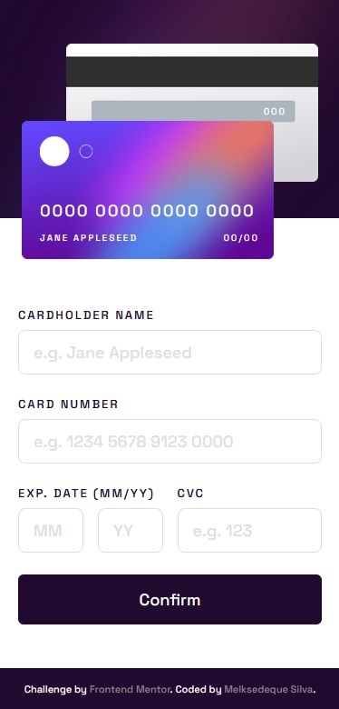

# Frontend Mentor - Interactive card details form solution

This is a solution to the [Interactive card details form challenge on Frontend Mentor](https://www.frontendmentor.io/challenges/interactive-card-details-form-XpS8cKZDWw). Frontend Mentor challenges help you improve your coding skills by building realistic projects. 

## Table of contents

- [Overview](#overview)
  - [The challenge](#the-challenge)
  - [Screenshot](#screenshot)
  - [Links](#links)
- [My process](#my-process)
  - [Built with](#built-with)
  - [What I learned](#what-i-learned)
  - [Continued development](#continued-development)
  - [Useful resources](#useful-resources)
- [Author](#author)
- [Acknowledgments](#acknowledgments)

**Note: Delete this note and update the table of contents based on what sections you keep.**

## Overview

### The challenge

Users should be able to:

- Fill in the form and see the card details update in real-time
- Receive error messages when the form is submitted if:
  - Any input field is empty
  - The card number, expiry date, or CVC fields are in the wrong format
- View the optimal layout depending on their device's screen size
- See hover, active, and focus states for interactive elements on the page

### Screenshot




### Links

- Solution URL: [Add solution URL here](https://your-solution-url.com)
- Live Site URL: [Add live site URL here](https://your-live-site-url.com)

## My process

### Built with

- Semantic HTML5 markup
- CSS custom properties
- [Flexbox](https://css-tricks.com/snippets/css/a-guide-to-flexbox/) - Flexbox
- CSS Grid
- Sass / SCSS
- Mobile-first workflow
- jQuery 3.6.4
- [Bootstrap](https://getbootstrap.com/) - Bootstrap 5.2.3

### What I learned

With this project I learned how to create validations to forms through JavaScript instead of use the HTML property "required". Not only the validation of blank fields, but I also used regex to filter the inputs and organize it the best way in the front, like this:

```html
<input type="text" class="form-control" id="number" name="number" maxlength="19" placeholder="e.g. 1234 5678 9123 0000">
```
```js
$('input[name="number"]').on('input', function(e) {
  $(this).val($(this).val().replace(/[^0-9]/g, '')); // This replace the content on the field to accept only numbers
  let num = $(this).val();
  let numSpaced = num.match(/.{1,4}/g); // This will match the numbers of the field in groups of 4 numbers
  $(this).val(numSpaced.join(' ')); // This will put a blank space between the groups of 4 numbers
});
```

### Continued development

Now I'm gonna focus on JavaScript to make this project better and create new and more complexes projects to develop myself.

### Useful resources

- [Bootstrap](https://getbootstrap.com/) - Bootstrap 5.2.3 - Used to create the CSS Grids and to use the preformatated CSS classes in the project instead of rebuild all the CSS Elements.
- [Flexbox](https://css-tricks.com/snippets/css/a-guide-to-flexbox/) - Flexbox - Used to size and position the elements.

## Author

- Website - [Melksedeque Silva](https://github.com/Melksedeque/)
- Frontend Mentor - [@Melksedeque](https://www.frontendmentor.io/profile/Melksedeque)